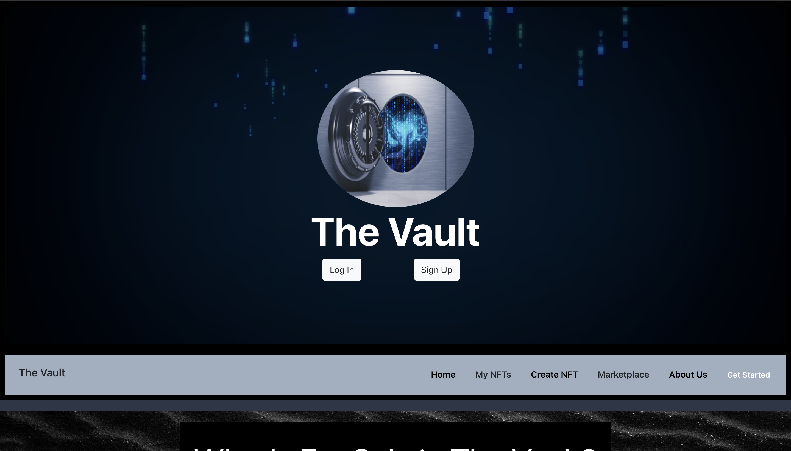
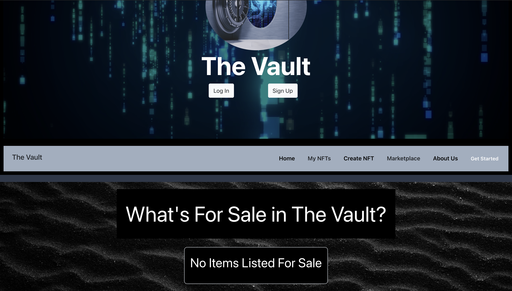
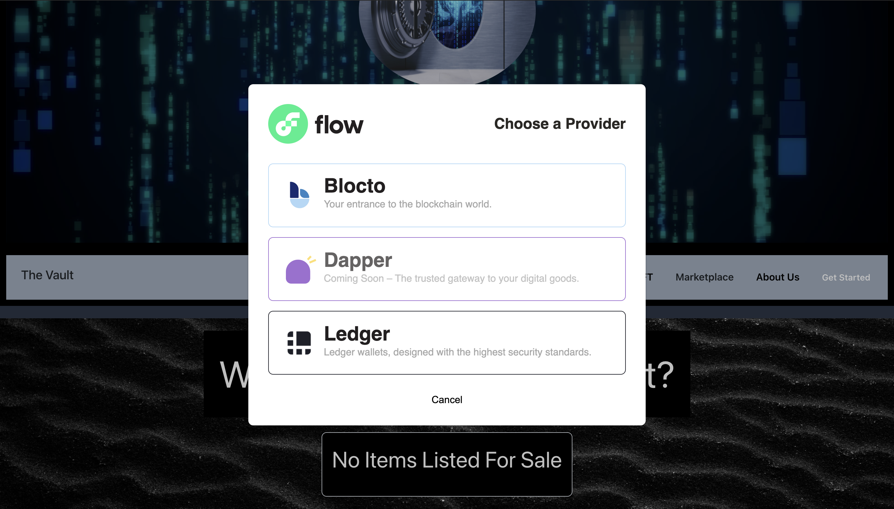
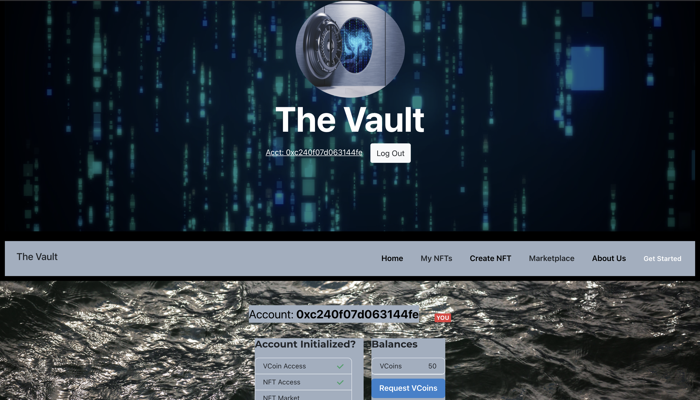
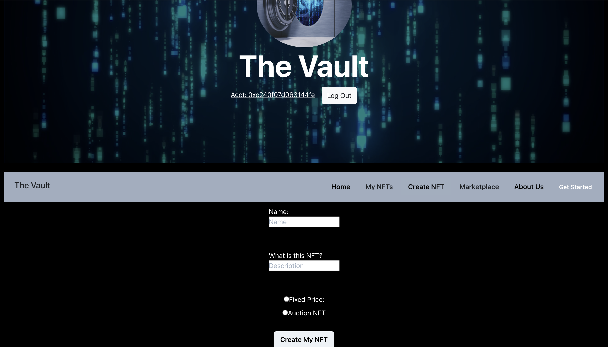

# The-Vault-Partial

This repository contains partial code for the NFT Marketplace, The Vault, that I am currently working on. I have not included all of the code because of private keys, environmental variables, node modules, and private configuration. However, most of the code is still there and I have included screenshots of what the website looks like when it is hosted locally. There are a couple bugs that I am currently working on with Heroku so that we can publically host the site, so until then the URL, https://nftvault.herokuapp.com/, will not work. 

# Screenshots of the Webiste

* Root Page

* Log In Portal

* Home Page

* Create NFT Page

